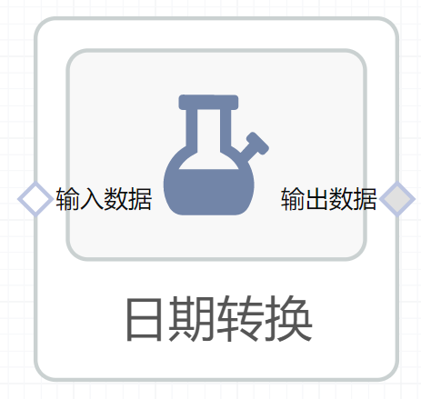

# 日期转换使用文档
| 组件名称 |日期转换|  |  |
| --- | --- | --- | --- |
| 工具集 | 机器学习 |  |  |
| 组件作者 | 雪浪云-墨文 |  |  |
| 文档版本 | 1.0 |  |  |
| 功能 |进行日期转换 |  |  |
| 镜像名称 | ml_components:3 |  |  |
| 开发语言 | Python |  |  |

## 组件原理
日期转换组件，可以将日期转换为时间戳，或者将时间戳转换为日期
## 输入桩
支持单个csv文件输入。
### 输入端子1

- **端口名称：** 输入数据
- **输出类型：** Csv文件
- **功能描述：** 输入需要日期转换的文件

## 输出桩
支持Csv文件输出。
### 输出端子1

- **端口名称：** 输出数据
- **输出类型：** Csv文件
- **功能描述：** 输出日期转换后的文件

## 参数配置
### 转换模式

- **功能描述：** 选择日期转换的模式
- **必选参数：** 是
- **默认值：** 日期转时间戳
### 日期格式

- **功能描述：** 转换日期的格式
- **必选参数：** 是
- **默认值：** （无）
### 源字段

- **功能描述：** 源字段
- **必选参数：** 是
- **默认值：** （无）
### 生成字段

- **功能描述：** 生成字段
- **必选参数：** 是
- **默认值：** （无）

## 使用方法
- 加组件拖入到项目中
- 与前一个组件输出的端口连接（必须是csv类型）
- 点击运行该节点

