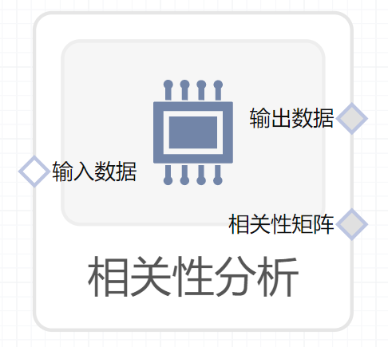

# 相关性分析使用文档
| 组件名称 |相关性分析|  |  |
| --- | --- | --- | --- |
| 工具集 | 机器学习 |  |  |
| 组件作者 | 雪浪云-墨文 |  |  |
| 文档版本 | 1.0 |  |  |
| 功能 |相关性分析 |  |  |
| 镜像名称 | ml_components:3 |  |  |
| 开发语言 | Python |  |  |

## 组件原理
相关性分析组件，分析数据列之间的相关性
## 输入桩
支持单个csv文件输入。
### 输入端子1

- **端口名称：** 输入数据
- **输出类型：** Csv文件
- **功能描述：** 输入需要相关性分析的文件

## 输出桩
支持Csv文件输出。
### 输出端子1

- **端口名称：** 输出数据
- **输出类型：** Csv文件
- **功能描述：** 处理后的文件
### 输出端子2

- **端口名称：** 相关性矩阵
- **输出类型：** image文件
- **功能描述：** 输出相关性矩阵
## 参数配置
### 相关性阈值

- **功能描述：** 相关性阈值
- **必选参数：** 是
- **默认值：** 0.9
### 相关性计算方法

- **功能描述：** 选择相关性的计算方法。pearson算法；kendall算法；spearman算法
- **必选参数：** 是
- **默认值：** pearson
### Min Periods

- **功能描述：** 最小周期数
- **必选参数：** 是
- **默认值：** 1
### 丢弃相关性高的列

- **功能描述：** 是否丢弃相关性高的列
- **必选参数：** 是
- **默认值：** false
### 生成图像宽度

- **功能描述：** 生成图像宽度
- **必选参数：** 是
- **默认值：** 12.8
### 生成图像高度

- **功能描述：** 生成图像高度
- **必选参数：** 是
- **默认值：** 9.6
### 目标字段

- **功能描述：** 目标字段
- **必选参数：** 是
- **默认值：** （无）
### 其他字段

- **功能描述：** 其他字段
- **必选参数：** 是
- **默认值：** （无）

## 使用方法
- 加组件拖入到项目中
- 与前一个组件输出的端口连接（必须是csv类型）
- 点击运行该节点

