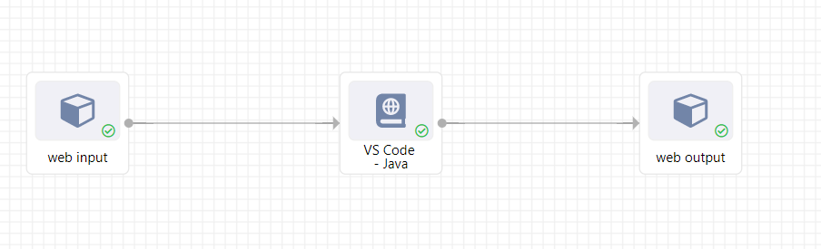
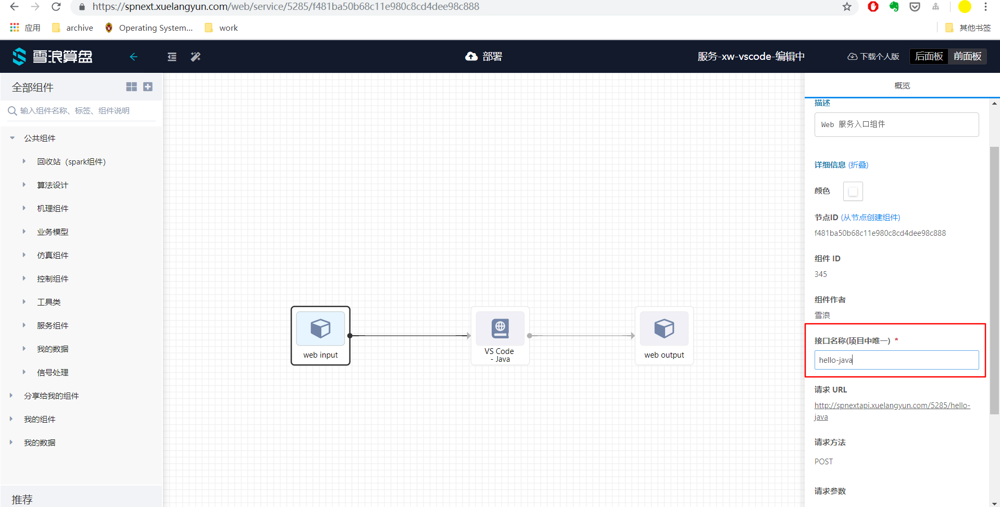
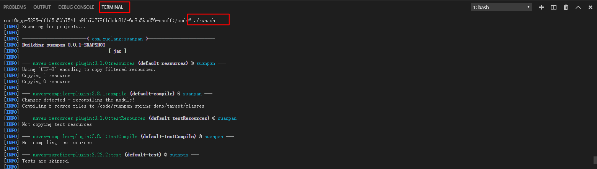
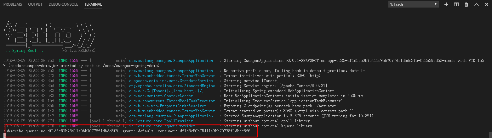
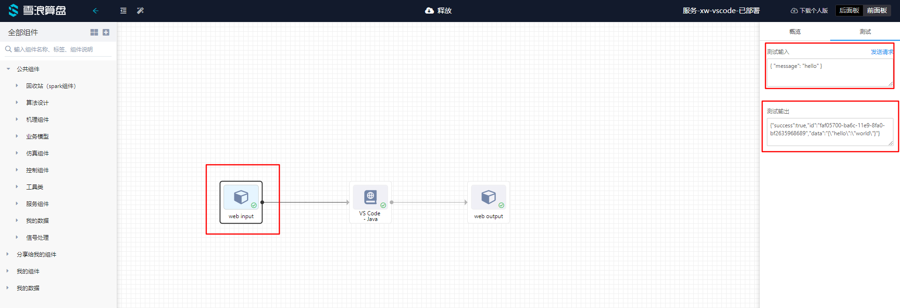
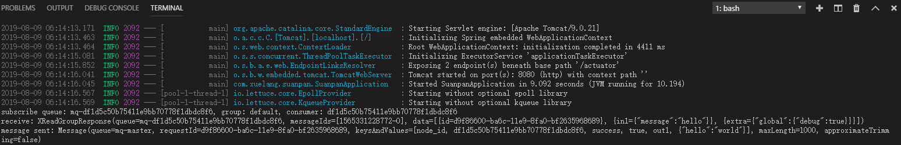

<a name="669d0776"></a>
## step 1：如图构建流程


<a name="dda197bb"></a>
## step 2：设置 Web Input 接口名称


<a name="8d423609"></a>
## step 3：测试示例程序

目前 VSCode Java 服务镜像提供了示例代码 suanpan-spring-demo 以及运行脚本 [run.sh](http://run.sh) 。

[run.sh](http://run.sh) 通过 maven 构建项目，生成可执行文件，并运行。

打开 Terminal，运行 run.sh

<br />程序成功启动，开始监听消息队列

<br />使用 Web Input 发送测试数据

<br />程序日志


<a name="687c2297"></a>
## step 4：关键代码解释

**suanpan-spring-demo/src/main/java/com/xuelang/suanpan/event/StartupEventHandler.java**

```
@Component
public class StartupEventHandler implements ApplicationListener<ApplicationReadyEvent> {

    @Autowired
    private StreamOption streamOption;
    @Autowired
    private MessageRecvHandler messageRecvHandler;

    private void subscribeToMq() {
        MqClient mqClient = streamOption.buildRedisClient();
        Consumer consumer = Consumer.builder()
                .queue(streamOption.getRecvQueue())
                .group(streamOption.getNodeGroup())
                .name(streamOption.getNodeId())
                .delay(streamOption.getRecvQueueDelay())
                .build();

        System.out.println(String.format("subscribe queue: %s, group: %s, consumer: %s",
                consumer.getQueue(), consumer.getGroup(), consumer.getName())
        );

        mqClient.subscribeQueue(
                consumer,
                this.messageRecvHandler,
                new LogExceptionMessageHandler()
        );
    }

    @Override
    public void onApplicationEvent(ApplicationReadyEvent applicationReadyEvent) {
        ExecutorService executorService = Executors.newSingleThreadExecutor();
        Future future = executorService.submit(this::subscribeToMq);
        try {
            future.get();
        } catch (Exception e) {
            throw new RuntimeException(e);
        }
        executorService.shutdown();
    }
}
```

onApplicationEvent 方法会在程序完成加载后执行，新开线程池调用 Java-SDK 中的 subscribeQueue 方法监听消息队列。

当监听到新消息时，会将消息交给 MessageRecvHandler 进行处理。

**suanpan-spring-demo/src/main/java/com/xuelang/suanpan/handler/MessageRecvHandler.java**

```
@Component
public class MessageRecvHandler implements XReadGroupHandler {

    @Autowired
    private MqService mqService;

    private String parseMessageId(List<Map<String, String>> data) {
        for (Map<String, String> item: data) {
            if (item.containsKey("id")) {
                return item.get("id");
            }
        }
        return UUID.randomUUID().toString();
    }

    @Override
    public void handle(XReadGroupResponse xReadGroupResponse) {
        System.out.println("receive: " + xReadGroupResponse);
        String messageId = parseMessageId(xReadGroupResponse.getData());
        JSONObject data = new JSONObject();
        data.put("hello", "world");
        mqService.sendSuccessMessageToTarget(
					Collections.singletonList("out1"), messageId, data
				);
    }
}
```

在 handle 方法中处理获得的消息，使用 MqService 提供的方法，将消息发送给 Web Output。
