<a name="ndHzG"></a>
## 组件制作
1. 通过ide创建spring项目，以idea为例，创建过程如下图所示：
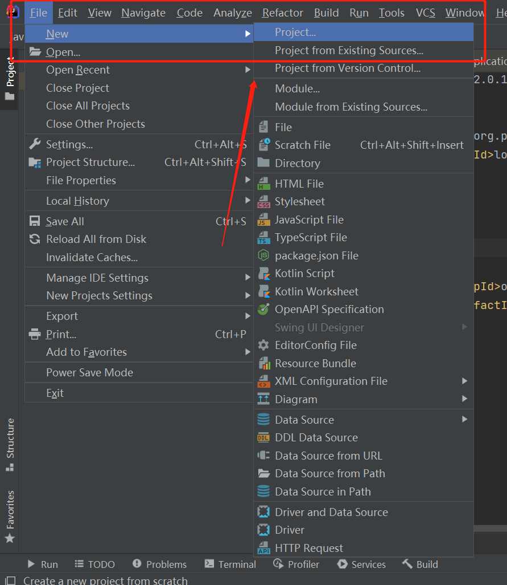<br />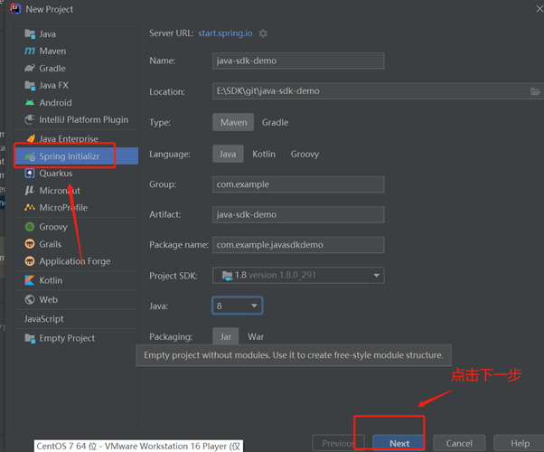<br />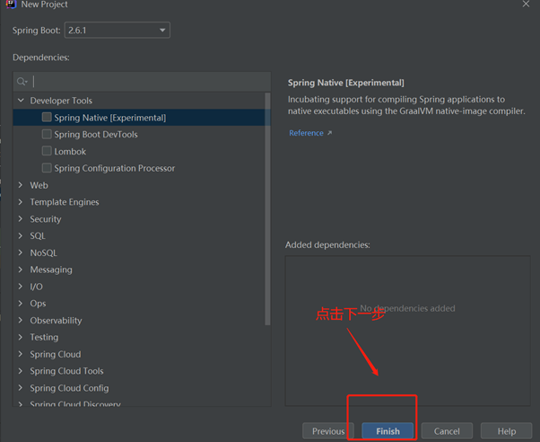

2. 点击“finish”后，创建的spring boot项目结构如下图所示：
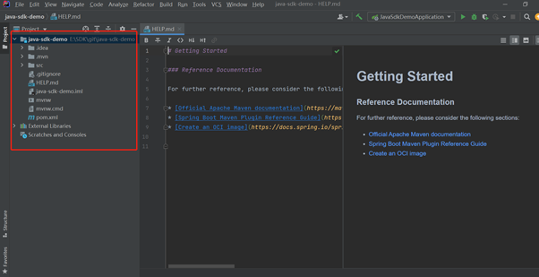

3. 修改pom.xml文件，添加如下依赖配置：
```xml
        <!-- suanpan-java-sdk -->
        <dependency>
            <groupId>com.xuelangcloud</groupId>
            <artifactId>suanpan-java-sdk</artifactId>
            <version>2.0.12</version>
        </dependency>

        <dependency>
            <groupId>io.socket</groupId>
            <artifactId>socket.io-client</artifactId>
            <version>2.0.1</version>
        </dependency>
        <dependency>
            <groupId>org.projectlombok</groupId>
            <artifactId>lombok</artifactId>
        </dependency>
```

4. 配置完成后，点击maven图标下载依赖jar，也可在控制台执行“maven install”命令：
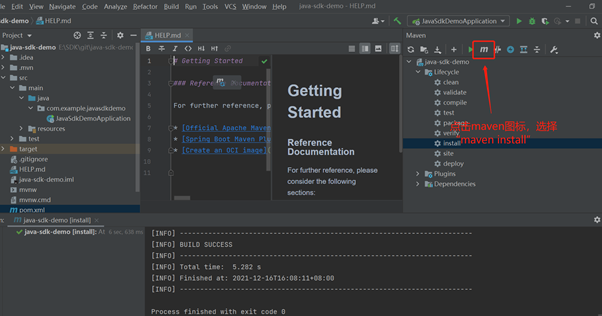

5. 在启动类上加上@EnableComponentConfig注释
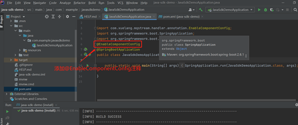

6. 创建监听器类，监听自定义事件，代码示例：
```java
import com.xuelang.mqstream.handler.annotation.BussinessListener;
import com.xuelang.mqstream.message.MessageRecvService;
import com.xuelang.mqstream.message.arguments.MessageDataType;
import com.xuelang.service.logkit.EventLogger;
import org.springframework.beans.factory.annotation.Autowired;
import org.springframework.boot.context.event.ApplicationReadyEvent;
import org.springframework.context.ApplicationContext;
import org.springframework.context.ApplicationListener;
import org.springframework.stereotype.Component;

import java.util.Arrays;
import java.util.Map;

@Component
public class ComponentListener implements ApplicationListener<ApplicationReadyEvent> {

    @Autowired
    private ApplicationContext applicationContext;
    @Autowired
    private EventLogger eventLogger;

    @Override
    public void onApplicationEvent(ApplicationReadyEvent applicationReadyEvent) {

        eventLogger.info("start recv msg");

        Map<String, Object> map = applicationContext.getBeansWithAnnotation(BussinessListener.class);

        Object[] bussiness = map.values().toArray();

        // 触发接收消息
        new MessageRecvService(Arrays.asList(bussiness), MessageDataType.COMMON.getCls()).subscribeMsg();
    }
}
```

7. 创建消息处理类，编辑自定义事件，添加业务逻辑处理，代码示例：
```java
import com.xuelang.mqstream.handler.annotation.BussinessListener;
import com.xuelang.mqstream.handler.annotation.BussinessListenerMapping;
import com.xuelang.mqstream.message.arguments.CommonType;
import com.xuelang.service.logkit.EventLogger;
import lombok.extern.slf4j.Slf4j;
import org.springframework.beans.factory.annotation.Autowired;
import org.springframework.stereotype.Component;
import org.springframework.stereotype.Service;

@BussinessListener
@Service
@Slf4j
public class DealMsgService {

    @Autowired
    private EventLogger eventLogger;

    /**
     * CommonType类型消息的处理方式
     *
     * @param commonType 收到的消息
     * @return 返回的消息
     */
    @BussinessListenerMapping(input = "in1", targets = {"out1"})
    public Object dealCommonTypeMsg1(CommonType commonType) {
        eventLogger.info("接收到消息: {} " + commonType.getMessage());
        Object in1 = commonType.getMessage().get("in1");

        //todo 在此处处理in1

        //返回消息至下一个节点
        return "SUCCESS:" + in1.toString();
    }

    @BussinessListenerMapping(input = "in2", targets = {"out2"})
    public Object dealCommonTypeMsg2(CommonType commonType) {

        //todo 在此处处理in2

        return "success";
    }
}
```

8. 打包项目，生成Jar文件（默认在target目录下生成）
9. 将jar包制作成镜像文件（客户端组件可直接跳过此步），镜像REPOSITORY需以registry.cn-shanghai.aliyuncs.com/shuzhi-amd64/开头，如registry.cn-shanghai.aliyuncs.com/shuzhi-amd64/spdemo，version自定义
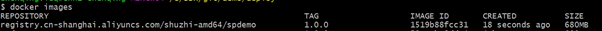

10. 打开算盘web进行组件制作
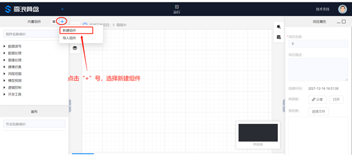

11. 在右面板配置组件名称、参数及图标
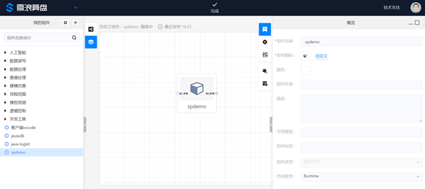

12. （云端组件）配置组件Docker镜像名和版本，如镜像为registry.cn-shanghai.aliyuncs.com/shuzhi-amd64/spdemo:1.0.0，则填写Docker镜像：spdemo:1.0.0
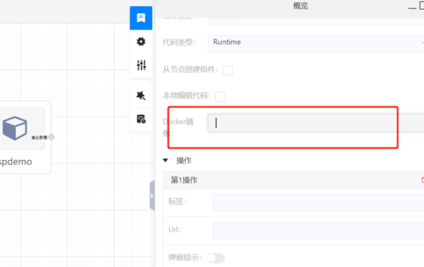

13. （云端组件）在“入口命令”配置镜像启动命令（注：该配置只有在填写完Docker镜像后才会出现），如下图所示：
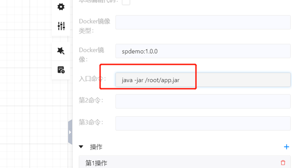

14. （客户端组件）打开算盘客户端安装目录下的/components文件夹，在文件夹下创建一个目录，例如“testDir”，配置“组件目录”为创建的文件夹名，“启动命令”为执行命令
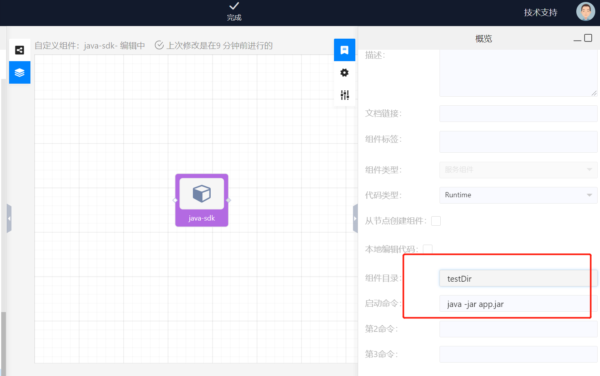

15. 根据自己的需要配置完后，点击上方的“完成”按钮，至此通过java开发的组件制作完成！
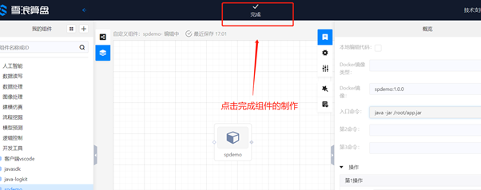<br />
<br />​

​<br />
<a name="Wj8Vt"></a>
## 执行日志
若需在组件“执行日志”显示某条日志，只需自动注入Bean工厂里的eventLogger Bean即可（执行日志将同步至节点OSS日志文件中）
```java
@Autowired
private EventLogger eventLogger;

public void test(){
	eventLogger.info("i'm event log");
    eventLogger.info("{} event log","hello,");
}
```
​

模板示例：[java-sdk-demo.zip](./data/java-sdk-demo.zip)<br />​<br />
<a name="CMHXD"></a>
## 常见问题
<a name="IJAD9"></a>
#### 中文日志乱码
启动命令参数配置-Dfile.encoding=GB2312<br />​<br />
