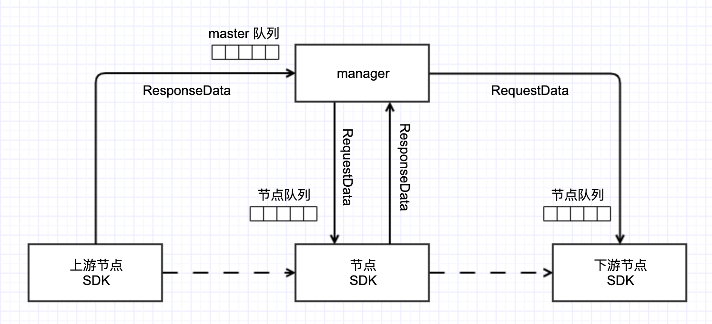

# Node SDK

## 介绍
算盘组件之间通过 Redis 消息队列进行消息通信，SDK 对 Redis 提供的 Stream API 进行了封装，提供了发送消息/对象存储等方法。

[SDK 目录约定](../算盘SDK约定.md)
## 安装

Make sure you have Node 10 or greater installed.<br />
Get the library：
```Bash
$ npm install suanpan_node_sdk --save
```
## 快速入门
```JavaScript
import { MessageListener, MessageHandler } from 'suanpan_node_sdk';

const messageHandler: MessageHandler = (message, chain) => {
  const headers = message.headers;
  const payload = message.payload;

  const requestId = headers.requestId;
  const timestamp = headers.timestamp;

  /** Business logic here */

  chain.send({ // 发送消息
    out1: 'xxxx',
    out2: true,
    out3: { success: true, result: [1, 2, 3] }
  });
}

MessageListener.onMessage(messageHandler);
```
## 功能点

- 获取右面版参数
- 流计算消息接受与发送
- 对象（OSS/MINIO）存储 API
- Logkit 结构化日志存储（EventLogger）
- 对象存储日志收集器（ObjectStorageLogger）

## API目录

- [Parameter](#parameter)
    - [.get([key]](#getkey)
- [Message](#message)
    - [constructor](#constructorheaders-payload)
    - [headers](#headers)
    - [payload](#payload)
- [MessageListener](#messagelistener)
    - [.onMessage(messageHandler)](#onmessagemessagehandler)
- [MessageChannelFactory](#messagechannelfactory)
    - [.createMessageChannel()](#createmessagechannel)
- [MessageChannel](#messagechannel)
    - [.receiveMessage()](#receivemessage)
    - [.sendMessage(message)](#sendmessagemessage)
- [MessageHandler](#messagehandler)
- [MessageChain](#messagechain)
    - [.send(payload)](#sendpayload)
- [MessageBuilder](#messagebuilder)
    - [.fromMessagePayload(message)](#frommessagepayloadmessage)
    - [.fromMessageHeaders(message)](#frommessageheadersmessage)
    - [.withPayload(payload)](#withpayloadpayload)
    - [.setHeader(key, value)](#setheaderkey-value)
    - [.setHeaderIfAbsent(key, value)](#setheaderifabsentkey-value)
    - [.build()](#build)
- [Storage](#storage)
    - [.append(objectName, content)](#appendobjectname-content)
    - [.putObject(objectName, data)](#putobjectobjectname-data)
    - [.listObjects(prefix[, recursive][, maxKeys])](#listobjectsprefix-recursive-maxkeys)
    - [.fGetObject(objectName, filePath)](#fgetobjectobjectname-filepath)
    - [.fPutObject(objectName, filePath)](#fputobjectobjectname-filepath)
    - [.deleteObject(objectName)](#deleteobjectobjectname)
    - [.deleteMultiObjects(objectNames)](#deletemultiobjectsobjectnames)
    - [.checkObjectNameExist(objectName)](#checkobjectnameexistobjectname)
    - [.getObjectToJSON(objectName)](#getobjecttojsonobjectname)
    - [.getObjectToString(objectName)](#getobjecttostringobjectname)
    - [.getObjectToBuffer(objectName)](#getobjecttobufferobjectname)
    - [.getObjectToStream(objectName)](#getobjecttostreamobjectname)
- [StoragePath](#storagepath)
    - [constructor](#constructoroptions)
    - [.getUserPath([userId])](#getuserpathuserid)
    - [.getAppPath([appId])](#getapppathappid)
    - [.getComponentPath([componentId])](#getcomponentpathcomponentid)
    - [.getNodePath([nodeId])](#getnodepathnodeid)
    - [.getAppLogPath([userId][, appId])](#getapplogpathuserid-appid)
    - [.getNodeLogPath([userId][, appId][, nodeId])](#getnodelogpathuserid-appid-nodeid)
    - [.getAppTempDir([userId][, appId])](#getapptempdiruserid-appid)
- [ObjectStorageLogger](#objectstoragelogger)
    - [constructor](#constructoroptions_1)
    - [.debug(message[, flush])](#debugmessage-flush)
    - [.info(message[, flush])](#infomessage-flush)
    - [.warn(message[, flush])](#warnmessage-flush)
    - [.error(message[, flush])](#errormessage-flush)
- [EventLogger](#eventlogger)
    - [debug(message)](#debugmessage)
    - [info(message)](#infomessage)
    - [warn(message)](#warnmessage)
    - [error(message)](#errormessage)

## Parameter

获取配置参数，以及内置一些常用参数，例如：AppId，NodeId 等
### .get([key])
Parameter Class 提供一个静态方法 .get([key]) 获取配置参数。<br />
**parameters:**<br />


- key {string}：参数名称。如果 key 为空，则获取“全部”配置参数。<br />


**example:**<br />
```JavaScript
import { Parameter, JSONObject } from 'suanpan_node_sdk';
/**
 * 内置参数
 */
const userId = Parameter.UserId
const appId = Parameter.AppId;
const nodeId = Parameter.NodeId;
const componentId = Parameter.ComponentId;

/**
 * 获取“单个”配置参数
 */
const paramValue = Parameter.get<string>('paramKey');

/**
 * 获取“全部”配置参数
 */
const params = Parameter.get<JSONObject>();
```

## Message

Message entity object. The constructor includes headers and payload. The message’s payload Object can not be set after the initial creation. However, the mutability of the header values themselves (or the payload Object) is intentionally left as a decision for the framework user.
### constructor(headers, payload)
#### headers
- headers { MessageHeaders } - Represents a collection of message headers for a message. The built-in read-only headers are:
    - requestId：An identifier for this message instance.
    - timestamp：The time the message was created. Changes each time a message is mutated.
#### payload


- payload {Object} - The data type of payload should strictly comply with the input / output port conventions of suanpan, such as: { in1: 111 }, { out1: 222 }. The content wrapped by the message can be any Javascript type, and because the interface is parameterized, you can retrieve the payload in a type-safe fashion.


**example：**<br />
```JavaScript
import { Message } from 'suanpan_node_sdk';

const customHeader = {
  'x-stream-id': 'xxxx'
};

const payload = {
	out1: 100
};
const message = new Message(customHeader, payload);
```
## MessageListener

流计算消息监听类，MessageListener 提供一个静态方法 onMessage 来处理发送的消息。
### .onMessage(messageHandler)
**parameters：**<br />


- messageHandler { MessageHandler }：消息处理回调函数。<br />


example 参照 [Quick Start](#_3)

## MessageChannelFactory

消息双向管道工厂类，MessageChannelFactory 提供一个静态方法 createMessageChannel 返回 MessageChannel 消息双向管道实例。
### .createMessageChannel()
return：<br />


- MessageChannel<br />


**example：**<br />
```JavaScript
import { MessageChannelFactory } from 'suanpan_node_sdk';

(async () => {
	const messageChannel = MessageChannelFactory.createMessageChannel();
  messageChannel.receiveMessage((message, chain) => {
      /** Business logic here */
    chain.send({
      out1: 'xxxx',
    });
  });
})();
```
## MessageChannel

消息双向通道接口，支撑流计算消息的接收和发送。不支持用户显示创建，仅能从 MessageChannelFactory 创建
### .receiveMessage()
接收消息，用户可以返回的 Message 自定义消息的处理逻辑。<br />
**return：**<br />


- Promise<Message>
### .sendMessage(message)
**parameters：**<br />


- message { Messsage }：消息实例

## MessageHandler

MessageHandler 是 Node SDK 定义的消息处理程序（此处仅表示函数类型），它作为回调函数注册到 channel 中。函数定义如下：
```JavaScript
type MessageHandler = (message: Message, chain: MessageChain) => void | Promise<void>;
```
函数参数 parameters 定义中包含：<br />


- message { Message }：传递的消息实体 <br />
- chain { MessageChain }：消息链，用于发送同源消息（组件的同步/异步机制）<br />


**example:**<br />
```JavaScript
import { MessageHandler } from 'suanpan_node_sdk';

const messageHandler: MessageHandler = (message, chain) => {
  const headers = message.headers;
  const payload = message.payload;

  const requestId = headers.requestId;
  const timestamp = headers.timestamp;

  /** Business logic here */

  chain.send({ // 发送消息
    out1: 'xxxx',
    out2: true,
    out3: { success: true, result: [1, 2, 3] }
  });
}
```
## MessageChain

消息链，用于发送同源消息（组件的同步/异步机制）<br />
**constructor**<br />


- message { Message} - 消息实体，包含 headers 和 payload 两部分<br />
- channel { MessageChannel } - 消息传输双向管道<br />
### .send(payload)
**parameters:**<br />


- payload { Object } <br />
- The data type of payload should strictly comply with the output port conventions of suanpan, such as: { out1: 111 }, { out2: 222 } <br />


**example:**<br />
```JavaScript
import { MessageChain, MessageBuilder, MessageChannelFactory } from 'suanpan_node_sdk';

(async () => {

  const requestMessage = MessageBuilder
    .withPayload({ in1: 'sss'})
    .setHeaderIfAbsent('requestId', 'uuid')
    .setHeaderIfAbsent('x-stream-id', '12345')
    .build();

  const messageChannel = MessageChannelFactory.createMessageChannel();
  const chain = new MessageChain(requestMessage, messageChannel);

  chain.send({ out1: 1234 })
})();
```
## MessageBuilder

消息建造者。双向消息管道传输媒介 Message 的建造者，并提供多种静态方法帮助用户构建自定义消息。<br />
### .fromMessagePayload(message)
提取并仅保留 message payload，返回当前建造者实例。<br />
**parameters:**<br />


- message { Message } : 消息实例<br />


**return：**<br />


- MessageBuilder

### .fromMessageHeaders(message)
提取并仅保留 message headers，返回当前建造者实例。<br />
**parameters:**<br />


- message { Message } : 消息实例<br />


**return：**<br />


- MessageBuilder

### .withPayload(payload)
添加消息 payload，返回当前建造者实例。<br />
**parameters:**<br />


- payload<br />


**return：**<br />


- MessageBuilder

### .setHeader(key, value)
添加消息 header，返回当前建造者实例。<br />
**parameters:**<br />


- key {string} - header key's name<br />
- value {string} - header key's value<br />


**return：**<br />


- MessageBuilder

### .setHeaderIfAbsent(key, value)
用法同 .setHeader，消息 header key'name 不存在时添加

### .build()
生成消息 Message 实例。<br />
return：<br />


- Message

## Storage

Storage 是对对象存储（目前支持 Aliyun OSS以及开源 Minio）API 的封装。
### .append(objectName, content)
Append an object to the bucket, it's almost same as putObject, but it can add content to existing object rather than override it.<br />
**parameters:**<br />


- objectName {string} - Name store on OSS<br />
- content {string} - What would you like to add to bucket<br />


**example:**<br />
```JavaScript
import { Storage } from 'suanpan_node_sdk';

(async () => {
  await Storage.Instance.append('/studio/userId/appId/nodeId/log.txt', 'redis subscribed.');
})();
```
### .putObject(objectName, data)
Uploads an object from a stream/Buffer/string.<br />
**parameters:**<br />


- objectName {string} - Name store on OSS<br />
- data {String | Buffer | ReadStream} - object data<br />


**example:**<br />
```JavaScript
import { Storage } from 'suanpan_node_sdk';

(async () => {
  await Storage.Instance.putObject('/studio/userId/appId/nodeId/data.js', 'const f = () => { console.log("a")}');
})();
```
### .listObjects(prefix[, recursive][, maxKeys])
List objects in the bucket.
**parameters:**<br />


- prefix {string} - Name prefix store on OSS，such as /studio/userId/appId/nodeId
- recursive {boolean} - Default：true。Recursively find all objects under “prefix”
- maxKeys {Number} - Max objects, default is 100, limit to 1000


**example：**<br />
```JavaScript
import { Storage, ObjectItem } from 'suanpan_node_sdk';

(async () => {
  const objects: ObjectItem[] = await Storage.Instance.listObjects('/studio/userId/appId/nodeId/', true, 200);
})();
```
### .fGetObject(objectName, filePath)
Downloads and saves the object as a file in the local filesystem.
**parameters:**<br />


- objectName {string} - Name store on OSS
- filePath {string} - Path on the local filesystem to which the object data will be written.


**example：**<br />
```JavaScript
import { Storage } from 'suanpan_node_sdk';

(async () => {
  await Storage.Instance.fGetObject('/studio/userId/appId/nodeId/coco.ts', '/tmp/coco.ts');
})();
```
### .fPutObject(objectName, filePath)
Uploads contents from a file to objectName.
**parameters:**<br />


- objectName {string} - Name store on OSS
- filePath {string} - Path of the file to be uploaded.


**example：**<br />
```JavaScript
import { Storage } from 'suanpan_node_sdk';

(async () => {
  await Storage.Instance.fPutObject('/studio/userId/appId/nodeId/coco.ts', '/tmp/coco.ts');
})();
```
### .deleteObject(objectName)
Removes an object. If delete object not exists, will also delete success.
**parameters:**<br />


- objectName {string} - Name store on OSS


**example：**<br />
```JavaScript
import { Storage } from 'suanpan_node_sdk';

(async () => {
  await Storage.Instance.deleteObject('/studio/userId/appId/nodeId/coco.ts');
})();
```
### .deleteMultiObjects(objectNames)
Removes multiple objects.
**parameters:**<br />


- objectNames {string[]} - List of objects in the bucket to be removed. such as['objectname1','objectname2']


**example：**<br />
```JavaScript
import { Storage } from 'suanpan_node_sdk';

(async () => {
  const objectList = ['/studio/userId/appId/nodeId/coco1.ts', '/studio/userId/appId/nodeId/coco2.ts'];
  await Storage.Instance.deleteMultiObjects(objectList);
})();
```
### .checkObjectNameExist(objectName)
Check whether the object exists，Returns true if it exists, otherwise false
**parameters:**<br />


- objectName {string} - Name store on OSS


**example：**<br />
```JavaScript
import { Storage } from 'suanpan_node_sdk';

(async () => {
	const exist = await Storage.Instance.checkObjectNameExist('/studio/not.json');
  if (exist) {
  	// do something
  }
})();
```
### .getObjectToJSON(objectName)
Get an object to JSON object
**parameters:**<br />


- objectName {string} - Name store on OSS


**example：**<br />
```JavaScript
import { Storage } from 'suanpan_node_sdk';

(async () => {
	const json = await Storage.Instance.getObjectToJSON('/studio/not.json');
})();
```
### .getObjectToString(objectName)
Get an object to string.
**parameters:**<br />


- objectName {string} - Name store on OSS


**example：**<br />
```JavaScript
import { Storage } from 'suanpan_node_sdk';

(async () => {
	const str = await Storage.Instance.getObjectToString('/studio/log.txt');
})();
```
### .getObjectToBuffer(objectName)
Get an object to Buffer.
**parameters:**<br />


- objectName {string} - Name store on OSS


**example：**<br />
```JavaScript
import { Storage } from 'suanpan_node_sdk';

(async () => {
	const buf = await Storage.Instance.getObjectToBuffer('/studio/log.txt');
})();
```
### .getObjectToStream(objectName)
Get an object to read stream.
**parameters:**<br />


- objectName {string} - Name store on OSS


**example：**<br />
```JavaScript
import { Storage } from 'suanpan_node_sdk';

(async () => {
	const stream = await Storage.Instance.getObjectToStream('/studio/demo.txt');
	stream.pipe(fs.createWriteStream('some file.txt'));
})();
```
## StoragePath

对象存储路径工具类。
### constructor([options])

|参数名|参数类型|是否必填|说明|
| --- | --- | --- | --- |
|userId|string|否|用户|Id|
|appId|string|否|项目|Id|
|componentId|string|否|组件 Id|
|nodeId|string|否|节点|Id|

### .getUserPath([userId])

|参数名|参数类型|是否必填|说明|
| --- | --- | --- | --- |
|userId|string|否|默认使用当前用户|Id|

### .getAppPath([appId])


|参数名|参数类型|是否必填|说明|
| --- | --- | --- | --- |
|appId|string|否|默认使用当前项目Id|


### .getComponentPath([componentId])


|参数名|参数类型|是否必填|说明|
| --- | --- | --- | --- |
|componentId|string|否|默认使用当前组件 Id|


### .getNodePath([nodeId])


|参数名|参数类型|是否必填|说明|
| --- | --- | --- | --- |
|nodeId|string|否|默认使用当前节点 Id|


### .getAppLogPath([userId][, appId])


|参数名|参数类型|是否必填|说明|
| --- | --- | --- | --- |
|userId|string|否|默认使用当前用户 Id|
|appId|string|否|默认使用当前项目Id|


### .getNodeLogPath([userId][, appId][, nodeId])


|参数名|参数类型|是否必填|说明|
| --- | --- | --- | --- |
|userId|string|否|默认使用当前用户 Id|
|appId|string|否|默认使用当前项目Id|
|nodeId|string|否|默认使用当前节点 Id|


### .getAppTempDir([userId][, appId])


|参数名|参数类型|是否必填|说明|
| --- | --- | --- | --- |
|userId|string|否|默认使用当前用户 Id|
|appId|string|否|默认使用当前项目Id|


## ObjectStorageLogger

对象存储日志收集器
### constructor(options)


|属性名|类型|是否必填|说明|
| --- | --- | --- | --- |
|storagePath|string|是|完整对象存储路径 objectName，例如：/studio/userId/appId/nodeId/log-2021-1014.txt|
|console|boolean|否|默认 false。开启后日志将会 print 到标准输入输出|
|level|Loglevel|否|默认 1 (debug)。日志等级|
|maxItems|number|否|默认 1。表示缓存长度。当日志积累条数 >= maxItems 时，将会触发 flush 操作，将日志上传到对象存储。|
|flushInterval|number|否|默认 0，单位 ms。即实时将日志保存到对象存储中。如果想控制每隔 1s 钟收集一次。设置其值为：1000|


### .info(message[, flush])
### .debug(message[, flush])
### .warn(message[, flush])
### .error(message[, flush])
**parameters:**<br />


- message {string} - 日志内容
- flush {boolean} - 默认：false。flush 为 true 时将会立即刷新日志到对象存储。


**example：**<br />
```JavaScript
import { StoragePath, ObjectStorageLogger } from 'suanpan_node_sdk';

const storagePath = new StoragePath();

const storageLogger = new ObjectStorageLogger({
  storagePath: storagePath.getNodeLogPath() + '/log.txt'
});

storageLogger.info('append this log');
```
## EventLogger

- EventLogger 提供日志的结构化存储（持久化在数据库中），模版释放后仍然保留，用于不同用户查看修改错误，用户重新部署后清除。logkit 能够直接运行在算盘 Server 中，也可以单独运行。
- EventLogger（内部使用 socketio 作为接口的基础协议）单向传输到 logkit。用户可以自己将业务日志通过 EventLogger 发送到算盘 logkit。
- EventLogger 默认情况下：用户代码（MessageHandler）运行时 Error，将会自动触发 EventLogger 的 error 事件，将结构化错误信息发送到 logkit。
### .info(message)
### .debug(message)
### .warn(message)
### .error(message)
**parameters:**<br />


- message {string} - logkit 日志内容


**example：**<br />
```JavaScript
import { EventLogger, MessageListener, MessageHandler } from 'suanpan_node_sdk';

const messageHandler: MessageHandler = (message, chain) => {
  const headers = message.headers;
  const payload = message.payload;

  const requestId = headers.requestId;
  const timestamp = headers.timestamp;
  
  if(!payload.in1) {
    EventLogger.Instance.error('received message is empty.');
    return;
  }

  chain.send({ // 发送消息
    out1: 'xxxx',
    out2: true,
    out3: { success: true, result: [1, 2, 3] }
  });
}

MessageListener.onMessage(messageHandler);
```
Type Reference

- MessageHeaders
- LogLevel
- StorageLoggerOptions
- Platform
**MessageHeaders**<br />
```JavaScript
export interface MessageHeaders {
  requestId: string;
  timestamp: number;
  extra: JSONObject;
}
```
**LogLevel**<br />
```JavaScript
export enum LogLevel {
  DEBUG = 1,
  INFO = 2,
  WARN = 3,
  ERROR = 4
}
```
**StorageLoggerOptions**<br />
```JavaScript
type StorageLoggerOptions = {
    storagePath: string;
    console?: boolean;
    level?: LogLevel;
    maxItems?: number;
    flushInterval?: number;
};
```
**Platform**<br />
```JavaScript
enum Platform {
    WINDOWS = 0,
    MACINTOSH = 1,
    LINUX = 2
}
```
