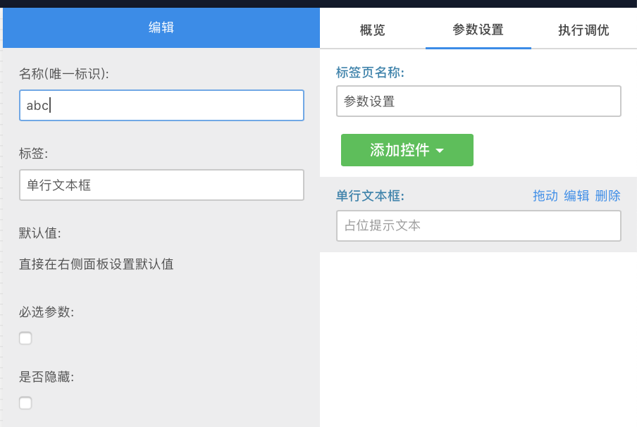
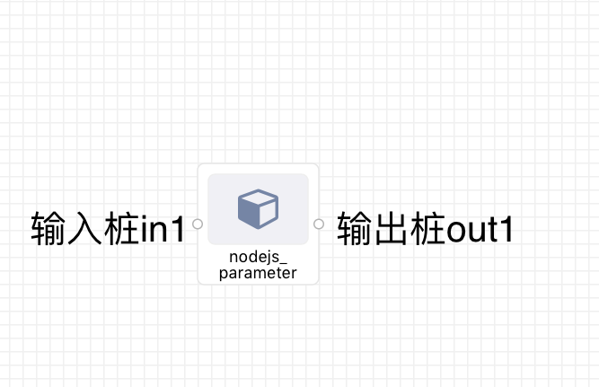

# SDK简介
## 简介

目前已作为npm包发布: npm
目前 node.js sdk 支持功能
1. 应用开发的消息接收与发送
2. 读取组件的右面板参数

[使用在线编辑器进行开发]()
## 当前版本 
最新:0.4.1
稳定:0.4.1
版本号变化遵循 [Semantic Versioning](https://semver.org/)
## 安装 sdk
```Bash
npm i -s suanpan_node_sdk
```

## API 使用方法
### 加载 sdk
```JavaScript
let sp = require('suanpan_node_sdk').sp
```

### 获得右面板配置参数(parameter)
```JavaScript
let spParameter = sp.parameter
console.log(spParameter)
```


如上图<br />
名称(唯一标示)abc的值<br />
可通过sp.parameter.abc获取<br />
⚠️其值类型为string

### 发送消息与接受消息
算盘中每个组件都会有一个或多个的输入/输出桩<br />
消息在组件之间经由连线在输出桩->输入桩之间传递<br />
对于组件内的代码而言，消息只能从输入桩上接受，并发送到指定输出桩<br />


#### 发送消息
##### 构建发送包
```JavaScript
let msgPackOut={
    out1:"a", //将发送 "a" 到out1输出桩
    out2:"b", //将发送 "b" 到out2输出桩
    // key(outN) 表示第N个输出桩, value必须是字符串
}
```

##### 主动发送信息
```JavaScript
sp.sendMessage(msgPack)
```

#### 接受消息
每当有新消息到达组件，则会触发Call事件

##### 监听 call 事件
```JavaScript
// 当由一个消息到达时候触发
sp.onCall((req, res) => {
    let msgPackIn = req.msg
    console.log(msgPackIn)
    // msgPackIn结构如下
    //{in1:"a"}
    // key(inN) 表示第N个输入桩, value是字符串
    // doSomething here
    res.send(msgPackOut)
})
```

##### 处理接送包
接受包是一个json字符串<br />
其中包含了各个输入桩上的消息<br />
其结构为<br />
```JSON
{
"in1":"hello"
}
```
接受消息后可直接调用res.send发送消息<br />
在call事件内，应尽量使用res.send来发送消息

## 其他
可供参考的代码<br />
https://github.com/ryanaltair/suanpan_nodejs_helloworld