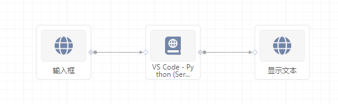
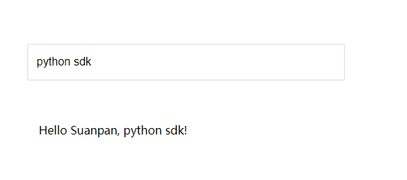

# 快速上手

雪浪算盘 SDK 用于开发算盘组件。组件的主要功能是接收上游发过来的消息，处理之后向下游发送结果。

下面的例子是在雪浪算盘上开发一个简单的 `hello suanpan` 示例组件。

!!! info "提示"

    本 Python SDK 基于雪浪算盘环境开发和运行，如果你还不了解算盘，请先阅读算盘`产品简介`。
    要基于 Python 开发算盘组件，首先需要有一个算盘环境，你可以申请一个雪浪算盘账号在线体验，
    或者下载安装算盘客户端，在自己电脑上尝试。

## 创建项目

在算盘上新建一个项目，在内置组件选择 `开发工具 > VS Code - Python` 拖入到后面板，然后编辑前面板，放入`文本` 和 `输入框` 两个组件。连接组件如下图所示：

<figure markdown>
  
</figure>

运行模板。

## 编写代码

打开 VS Code 的编辑界面，在 `main.py` 中写入下面的代码：

``` python title="main.py"
import suanpan
from suanpan.app import app
from suanpan.app.arguments import String


@app.input(String(key="inputData1"))
@app.output(String(key="outputData1"))
def HelloWorld(context):
    args = context.args
    return f'Hello Suanpan, {args.inputData1}!'


if __name__ == "__main__":
    suanpan.run(app)
```

## 运行项目

在 VS Code 的 Terminal 中执行

```bash
./run.sh
```

run.sh 会把组件代码执行起来。

然后在算盘右下角打开预览界面，在输入框输入 `python sdk`，下面的文本框会显示组件节点处理之后的消息：`Hello Suanpan, python sdk!`。效果如下图所示：

<figure markdown>
  
</figure>

