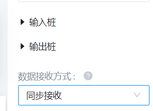

# 输入输出

## 组件输入

在前面的例子中，我们为组件定义了一个输入桩，组件支持多个输入桩。下面的例子定义了两个输入桩。

```python
import suanpan
from suanpan.app.arguments import Int

@app.input(Int(key="inputData1", alias="num1"))
@app.input(Int(key="inputData2", alias="num2"))
@app.output(Int(key="outputData1"))
def add(context):
    args = context.args
    # 计算两个数的和
    return args.num1 + args.num2
```

默认情况下组件的数据接收方式是`异步接收`，意味着输入桩 `inputData1` 或 `inputData2` 只要有一个数据到达就会执行 `add` 方法，这种情况下组件执行会报错，因为另外一个输入桩的数据是 `None`。我们需要将此组件的数据接收方式设置为`同步接收`。

<figure markdown>
  
</figure>

!!! info "提示"

    1. 异步接收：单个输入到达即触发计算。
    2. 同步接收：所有输入到达才触发计算。

## 组件输出

同输入一样，组件也支持多个输出桩。通常情况下，一个输入消息会产生一个输出消息，SDK 会根据消息处理函数的返回结果，转换之后传到消息队列。而有些情况，用户也可以自己决定发送消息。

!!! info "提示"

    按照输出桩定义的顺序，输出桩的名字依次为 `out1`, `out2`, `out3` ...

### 自动发送

#### 按输出桩定义顺序发送

如果消息处理函数返回多个结果，SDK 采用 Python 原生的函数 return 多输出方式，匹配顺序与输出描述顺序相同，如上所示：1 与 out1 关联，2 与 out2 关联。

```python
import suanpan
from suanpan.app import app
from suanpan.app.arguments import Int

@app.output(Int(key="outputData1", alias="out1"))
@app.output(Int(key="outputData2", alias="out2"))
def Demo(context):
    return 1, 2

if __name__ == "__main__":
    suanpan.run(app)
```

!!! warning "注意"

    顺序发送模式下，SDK 将输出结果与输出参数一一对应，如果输入桩数量和函数返回值数量不一致，多余的输出将跳过。

#### 按输出桩名称字典发送

在字典发送匹配下，采用返回一个字典的方式进行多输出，SDK 将会根据字典的 key 去关联对应的输出参数，该 key 可以为输出参数的关键字（key）或别名（alias）

```python
import suanpan
from suanpan.app import app
from suanpan.app.arguments import Int

@app.output(Int(key="outputData1", alias="out1"))
@app.output(Int(key="outputData2", alias="out2"))
def Demo(context):
    return { "out1": 1, "out2": 2 }

if __name__ == "__main__":
    suanpan.run(app)
```

!!! warning "注意"

    在字典匹配模式下，SDK 将输出结果与输出参数一一对应，如果输入桩数量和函数返回值数量不一致，多余的输出将跳过。

#### 不输出

如果组件不需要输出可以采用不返回或者显式返回 None 的方式

```python
import suanpan
from suanpan.app import app
from suanpan.app.arguments import Int

@app.output(Int(key="outputData1", alias="out1"))
@app.output(Int(key="outputData2", alias="out2"))
def Demo(context):
    return None

if __name__ == "__main__":
    suanpan.run(app)
```

### 直接发送

在组件中可以使用 `app.send` 方法，在任意时候发送消息到消息队列。SDK 自动发送的方式就是调用的 `app.send` 函数实现的，所以与调用方式一致。

#### 按输出桩定义顺序发送

同上面情况类似，`app.send` 的参数为一个 list 或 tuple 时，会将 list 内数据按顺序发送到各个输出桩。

```python
import suanpan
from suanpan.app import app
from suanpan.app.arguments import Int

@app.output(Int(key="outputData1", alias="out1"))
@app.output(Int(key="outputData2", alias="out2"))
def Demo(context):
    app.send([1, 2])

if __name__ == "__main__":
    suanpan.run(app)
```

!!! warning "注意"

    顺序发送模式下，SDK 将输出结果与输出参数一一对应，如果输入桩数量和函数返回值数量不一致，多余的输出将跳过。

#### 按输出桩名称字典发送

如果 `app.send` 的参数传入的是字典，则会根据字典的 key 发到相应的输出桩。

```python
import suanpan
from suanpan.app import app
from suanpan.app.arguments import Int

@app.output(Int(key="outputData1", alias="out1"))
@app.output(Int(key="outputData2", alias="out2"))
def Demo(context):
    app.send({ "out1": 1, "out2": 2 })

if __name__ == "__main__":
    suanpan.run(app)
```

!!! info "提示"

    可以使用多次调用 `app.send` 函数的方式来实现多次输出

!!! warning "注意"

    在字典匹配模式下，SDK 将输出结果与输出参数一一对应，如果输入桩数量和函数返回值数量不一致，多余的输出将跳过。

!!! warning "注意"

    如果非上述 list, tuple, dict 类型，`app.send` 认为只有一个输出桩。
