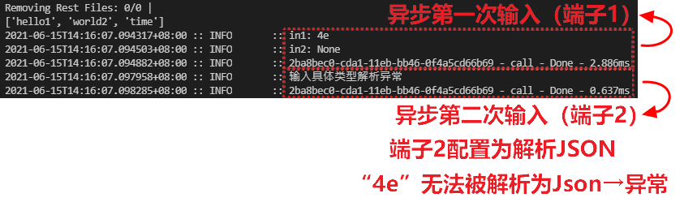
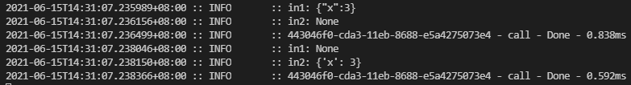
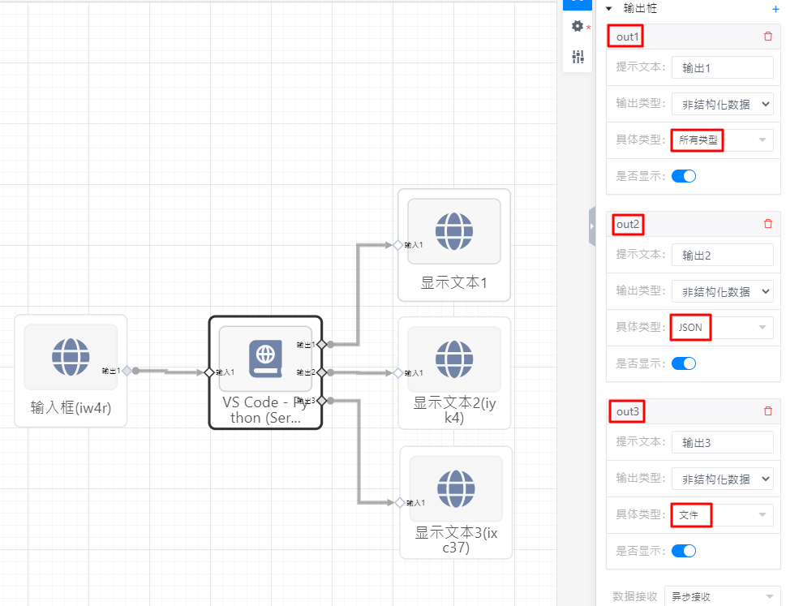
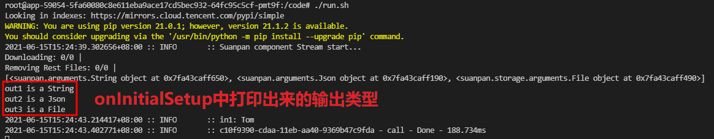
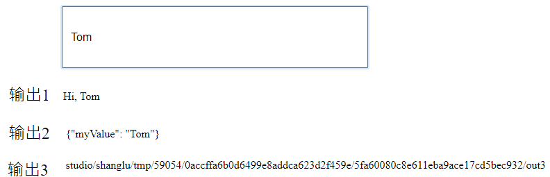

# 动态参数

## 如何接收任意数量输入

1. 右面板增加任意多个“输入桩”
1. 配置每个“输入桩”的“具体类型”

    

3. 在程序中按名称“加载”输入。

```python
import suanpan
from queue import Queue
from suanpan.app import app
from suanpan.node import node
from suanpan.app.arguments import String, Json
from suanpan.log import logger


@app.output(Json(key="outputData1"))
def onInput(context):
    args = context.args
    try:
        inargs = app.load(node.inargs)  # 根据右面板配置的“具体类型”加载输入数据
    except:
        # 如果输入的字符串无法解析为配置的具体类型，将会发生异常。
        # 比如“具体类型”配置为“JSON”，但输入的字符串是一个非法的Json字符串。
        logger.info(f"输入具体类型解析异常")
        return
    in1 = inargs.get("in1")  # in1 是第一个输入端子
    logger.info(f"in1: {in1}")
    in2 = inargs.get("in2")  # in2 是第二个输入端子
    logger.info(f"in2: {in2}")
    return in1


@app.afterInit
def onInitialSetup(context):
    args = context.args


if __name__ == "__main__":
    suanpan.run(app)
```

输入字符串“4e”测试两个输入桩的解析效果，输入桩2异常，因为这个字符串是非法Json字符串。

因为节点配置为“**异步接收**”任意输入端子有输入会进入一次消息处理函数，因此此节点输入入口函数会被调用两次。



又如输入字符串为“`{"x":3}`”，两个端子都会正常解析。（异步输入，call了两次）



## 如何输出任意数量输出

1. 右面板增加任意多个“输出桩”
2. 配置每个“输出桩”的“具体类型”

    

3. 在程序中按名称“加载”输出类型。
4. 用 `send` 函数给任意输出端子提供输出数据。

```python
import suanpan
from queue import Queue
from suanpan.app import app
from suanpan.node import node
from suanpan.app.arguments import String, Json, File
from suanpan.log import logger


@app.param(String(key="param1", default="1"))
def onInput(context):
    args = context.args
    try:
        inargs = app.load(node.inargs)  # 根据右面板配置的“具体类型”加载输入数据
    except:
        logger.info(f"输入具体类型解析异常")
        return
    in1 = inargs.get("in1")  # in1 是第一个输出端子
    logger.info(f"in1: {in1}")

    # 创建一个文件用于测试输出端子3
    fname = "newFile.txt"
    with open(fname, "w") as f:
        f.write("Hello")
        f.write("\n")

    app.send({"out1": in1, "out2": {"myValue": in1}, "out3": fname}, args=node.outargs)
    # 您也可以只输出“部分”端子，如
    app.send({"out1": "Hi, "+ in1, "out2": {"myValue": in1}}, args=node.outargs)


@app.afterInit
def onInitialSetup(context):
    args = context.args
    outargs = node.outargs # “加载”输出类型
    print(outargs)
    # 打印每个输出端子输出类型
    for i, outarg in enumerate(outargs):
        print(f"out{i+1} is a {outarg.__class__.__name__}")


if __name__ == "__main__":
    suanpan.run(app)
```



测试输入输出，

输出3：

- 注意`File`类型的输出字符串需要是一个文件路径（相对/绝对路径），
- 输出时文件会自动上传 **并被删除**（因此如果是需要持久化的文件，开发者需要注意备份该输出文件）


