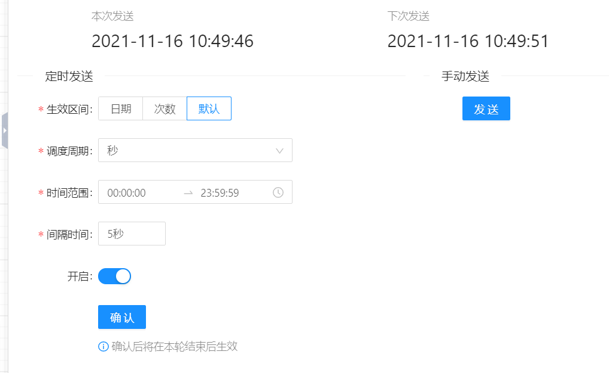
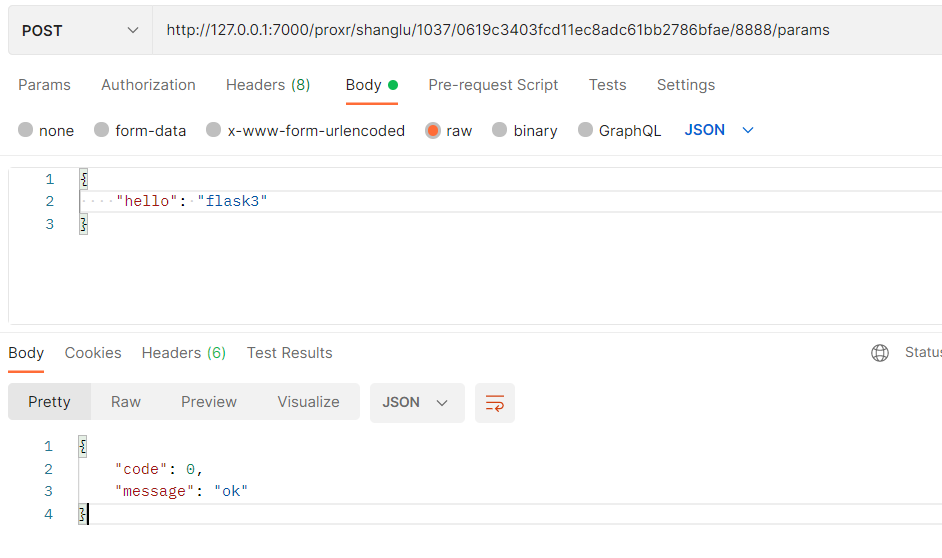
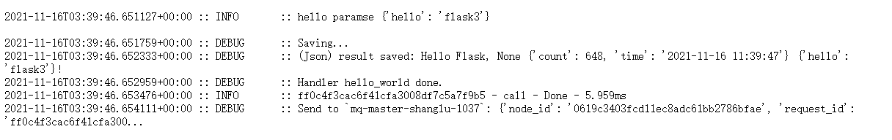

# 带页面展示的组件

有些时候我们需要组件能够展示数据，或者进行一些复杂的设置，这种情况下就需要开发带有 Web 页面的组件。



## Flask 代码示例

suanpan python sdk 默认内置了 socketio 的 web 服务，但是外部开发人员一般会使用 Flask，下面以 Flask 为例，做一个具有页面展示，保存数据的组件。

```python
import suanpan
from flask import Flask, request, render_template
from suanpan import g
from suanpan.app import app
from suanpan.log import logger
from suanpan.utils import json
from suanpan.storage import storage
from suanpan.app.arguments import String, Json


def saveParams(params):
    # 将输入参数保存到 oss
    paramsFileKey = storage.getKeyInNodeConfigsStore("saved.json")
    paramsFilePath = storage.getPathInNodeConfigsStore("saved.json")
    json.dump(params, paramsFilePath)
    storage.upload(paramsFileKey, paramsFilePath)


def loadParams():
    # 从 oss 中读取参数
    paramsFileKey = storage.getKeyInNodeConfigsStore("saved.json")
    paramsFilePath = storage.getPathInNodeConfigsStore("saved.json")
    storage.download(paramsFileKey, paramsFilePath)
    return json.load(paramsFilePath)


def create_app():
    # create and configure the app
    web = Flask(__name__)

    # a simple page that says hello
    @web.route('/')
    def hello():
        return render_template('pure.html')

    # set some parameters and save to oss
    @web.route('/params', methods=['POST'])
    def params():
        params = request.get_json()
        logger.info(f'set new params: {params}')

        # 存储配置到oss，组件重启之后可以load
        saveParams(params)

        # 存储临时变量到 g，可以和消息事件共享
        g.someParameter = params

        return {'message': 'ok', 'code': 0}

    return web


def runFlask():
    # 初始化一个 flask
    web = create_app()
    # flask 由 suanpan app 加载
    app._stream.sioLoop.setWebApp(web)


@app.afterInit
def afterInit(context):
    try:
        # 组件初始化，从oss读取保存的参数配置
        g.someParameter = loadParams()
    except:
        pass

    # 在sdk中运行flask，会自动分配端口
    runFlask()


@app.input(Json(key="inputData1", alias="user_text", default="Suanpan"))
@app.param(String(key="param_prefix", alias="prefix"))
@app.output(Json(key="outputData1", alias="result"))
def hello_flask(context):
    args = context.args
    logger.info(f'hello flask {args}')
    logger.info(f'hello paramse {g.someParameter}')
    return f'Hello Flask, {args.prefix} {args.user_text} {g.someParameter}!'


if __name__ == "__main__":
    suanpan.run(app)

```

## 代码说明

1. `afterInit` 会在 app 启动之后，流计算开始之前执行，在这个方法里，首先从 oss 读取上次保存的参数信息，然后初始化运行 flask 服务；
2. `hello_flask` 是流计算的处理方法，实现消息的处理和结果返回；
3. `params` 接收 POST 请求的参数，将参数保存到 oss 中，下次组件重启时可以从 oss 中读取上次保存的参数设置；同时将 params 赋予 `g.someParameter`，在流处理方法中`hello_flask`可以直接使用。

!!! info "提示"

    `g` 在 SDK 中保存全局变量，`g.someParameter` 的赋值可以使之在不同服务之间都能访问到。

## 组件设置

如果组件带有前端页面，在右面板操作栏配置。如下图示例，在第1操作标签栏填写标签名称，在 Url 栏填写组件前端服务的算盘访问地址 `{{protocol}}//{{host}}/proxr/{{userId}}/{{appId}}/{{nodeId}}/8888/`，其中 8888 是 sdk 默认的 web 服务逻辑地址，如果使用的是自己定义的服务，对应修改。


## 运行

通过 api 请求设置如下参数：



组件中保存配置的参数：



组件重启之后也能保持之前配置的参数。

## 注意事项

带前端页面的组件开发与与正常的前端开发一样，唯一要注意的区别是前端引用的静态文件地址不能以 '/' 开头。由于在算盘中访问组件页面是通过算盘的代理地址转发，如果是如下静态文件地址，在算盘中显示的组件页面会产生问题。

```html
    <link rel="stylesheet" href="/static/css/bootstrap.min.css">
    <link rel="stylesheet" href="/static/css/style.css">
    <link rel="stylesheet" href="/static/css/toastr.min.css">
```

需要修改成下面的样子：

```html
    <link rel="stylesheet" href="static/css/bootstrap.min.css">
    <link rel="stylesheet" href="static/css/style.css">
    <link rel="stylesheet" href="static/css/toastr.min.css">
```

!!! warning "注意"

    前端的引用地址请使用相对路径。
